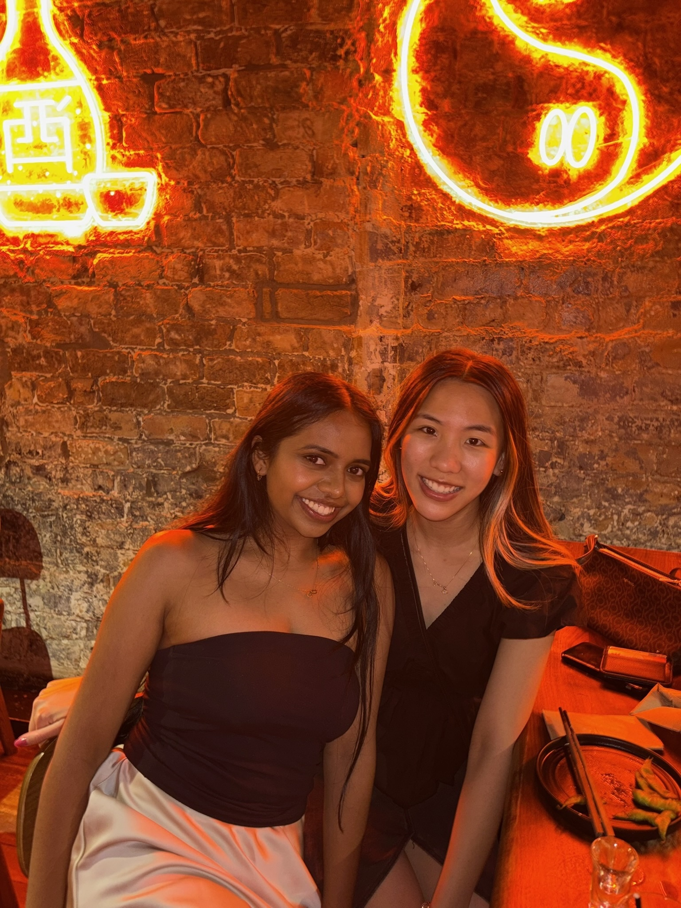

## Welcome to my website! :)

 

      
Hi! I’m Karishma 🤓 

      
I love <strong>reading</strong>, <strong>listening to music</strong>, and spending time with <strong>friends & family</strong>. Something you should know about me is my favourite time of year is <strong>Garba! 💃🏽🪷</strong>

    
 
  

  

<h2> Check out some photos of me 📸</h2>
    

  

    💖
    
    
In LONDON! 🇬🇧

  

  

    ❤️
    
    
I love my friends!

  

  
  

    💕
    
    
Call me maybe?☎️

  

  

  
Some <strong>2025 goals</strong>:

  <li>Sit the CFA Level 1 exam in November 📆</li>
  <li>Drink more water 💧</li>
  <li>Go on runs and gym more regularly! 🏃🏽‍♀️💪🏾</li>
  
This site is for me to challenge myself and keep a record of my favourite books and cafes that I visit. I am working in Corporate Finance and eventually could post some deals I've worked on, so watch the space! ... 👀

  

  <video width="320" height="480" controls>
    <source src="media/kobe.MP4" type="video/MP4">
  </video>

I'm so silly 😛😋 and I'm really good at arcade basketball and bowling FYI 

  <h3>Here's an audio of me playing the piano 🎹</h3>

  

  <audio controls>
    <source src="media/song.mp3" type="audio/mpeg">
    Your browser does not support the audio element.
  </audio>
  
Can you guess the song?

  

---

## Books Review 📚
Write your books review here!

**Book:**  
_The name of the book_

**Author:**  
_Who wrote it_

**Score out of 10:**  
_Your rating_

**Thoughts / Comments:**  
_What you liked, didn’t like, or anything special_

---
 
## Cafe Review ☕️
 
**Cafe Name:**  
_Where did you go_

**Location:**  
_Suburb or city_

**What did I order:**  
_E.g. Chai latte and almond croissant_

**Score out of 10:**  
_Your rating_

**Thoughts / Comments:**  
_Atmosphere, vibe, food, etc._

---
## 👋 Let’s get connected!

<a href="https://www.linkedin.com/in/karishma-patel-" target="_blank" style="text-decoration:none;">
  
  Connect with me on LinkedIn
</a>